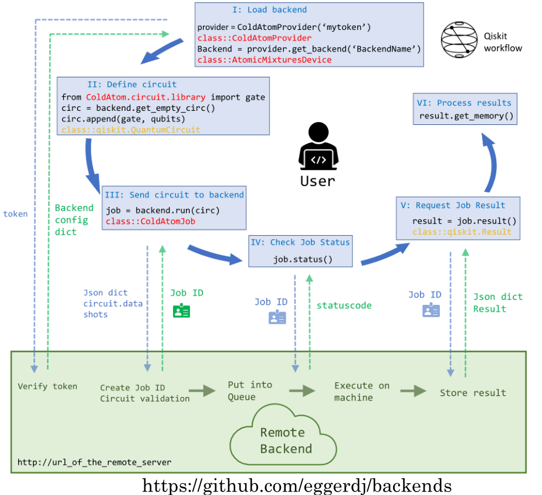

# Django for labscript

## The big picture
There are two sides : server and client. A client is a remote user who will write quantum circuits in the user's favorite framework (Qiskit/Pennylane). These circuits then have to be compiled into JSON files. The JSON files can be sent over the internet to a remote server which will try to parse them into meaningful instructions for the backend. The backend can be a real cold atom machine or just a simulator running on a computer.

We have decided on a schema for the JSON files. See [1][eggerdj_github]  for more details. The document mentions in detail how things should be formatted.

The code for compiling Qiskit circuits to JSON files is available at [1][eggerdj_github]. Similarly the code for compiling a pennylane circuit into JSON is available at [2][synqs_pennylane_github].

In the next section we explain the server side in detail.

## Components of the server

### The Django app

We describe the Django app which controls the communication to the real machine, but for other apps, the views and their purpose are similar. Django is a Python-based free and open-source web framework. It uses the Model-View-Template architecture:
* Model : Build databases from classes with the help of Object Relational Mapper (ORM).
* View : Function executed whenever a particular URL receives an HTTP request. For every URL there is a corresponding view function.
* Template : HTML/CSS code for inserting web elements in a HTML document.

Note that Django is just a framework to design webapps. Its not a server by itself. After writing a webapp it has to be hosted on a server. Although, Django also comes with a built-in server but this is meant only for local testing and development. In production environment one must use a proper server like Apache web server, Gunicorn, waitress etc. to host the webapp.

Another point is that although we have a Django webapp running on our server, it is functionally equivalent to a REST API. REST API is a popular architecture of communicating with remote servers.

Before describing the server in detail, lets mention that for the client communicating with the server essentially boils down to sending correct HTTP request to the correct URL. Then on the server side Django will execute the view function corresponding to that URL.

Now we explain different view functions and their purpose. :
* **The get_config view** : This function returns a JSON dictionary containing the backend capabilities and details. At the moment this is relevant only for the Qiskit plugin as the pennylane plugin does not make use of it.
* **The post_job view** : This function extracts the JSON dictionary describing a potential experiment from a HTTP request. The extracted JSON is dumped onto the hard disk for further processing. It then responds with another JSON dictionary which has a job_id key. This job_id is important to query the server for results of the experiment later on.
* **The get_job_status view** : This function extracts the job_id of a previously submitted job from a HTTP request. It responds with a JSON dictionary describing the status.
* **The get_job_result view** : This function extracts the job_id of a previously submitted job from a HTTP request. If the job has not finished running and results are unavailable, it responds with a JSON dictionary describing the status. Otherwise it responds with a JSON dictionary describing the result. The formatting of the result dictionary is done as decsribed in [1][eggerdj_github].

A typical JSON response from the server has the following schema:
``
{'job_id': 'None','status': 'None','detail': 'None'}
``

### The Spooler.py
After the post_job view dumps the JSON files on the hard disk they have to be processed further to execute experiments on the cold atom machine. Also dumping files on the hard disk acts as a job queue so we do not need to use any extra package to queue the jobs.

In order to run experiments on our cold atom setup, we use the [labscript suite][labscript_github]. This means we have to convert the received JSONs into python code understandable by labscript. This is done by Spooler.py file.

The Spooler checks for a JSON every 3 seconds in the dump location on the hard drive. It then picks up the JSON that was created first and starts to process it. After all the steps of processing are done the JSON file is moved to a different folder.

During processing the spooler first checks, if the JSON satisfies the schema. This is also a safety check which allows to see if the user submitted anything in the JSON which is inappropriate. After this it updates the status dictionary. Then it continues processing by using the JSON to extract an experiment python file for labscript and set the value of parameters in **Runmanager**. After generating the files and setting parameters, the spooler triggers the execution of the experiment via runmanger remote API commands. The status dictionary for that job is appropriately updated.

In labscript all the shots generated from a given python code are stored as HDF files. Lets say for a given experiment python file we have 10 shots i.e. 10 HDF files. These shots are passed from **Runmanager** to **BLACS** for actual execution. **BLACS** queues all the shots and executes them sequentially. All data pertaining to a shot (e.g. value of parameters, camera images etc.) is stored in its HDF file. Further data analysis is now run on these HDF files.

### The Result.py
After the shots have been executed, we use **Lyse** to run analysis routines on the HDF files. There are two types of analysis routines: single shot and multi shot. Single shot routines are run on each shot individually for e.g. calculate atom number in each shot or size of atom cloud in each shot. Multishot routines are run on a collection of shots and are helpful to see for e.g. how the atom number in each shot changed as some parameter was varied across shots.

Given the location of a shot folder **Lyse** can generate a pandas dataframe by reading all the values, be it **Runmanager** globals or analysis routine results. It is this pandas dataframe we are interested in.

Currently by using QisKit plugin if we had to scan a parameter across shots, it was done by creating a new experiment dictionary for each value of the parameter. So for e.g. if we want to scan a parameter across 5 values, our job JSON dictionary will have 5 nested experiment dictionaries in it, one each for a particular value of the parameter. And each of the 5 experiment dictionaries will also have a **shots** key which will tell how many times that particular experiment is repeated.

When the Spooler starts execution of this JSON in labscrpit, it will create a job folder with job_id name. Inside this job folder there will be 5 sub-folders one for each experiment. Inside each experiment's folder will be the HDF files for the shots of that particular experiment.

As the individual shots get executed they dump their complete HDF path in separate a text file for each shot. This way we know which shots have finished executing. The result.py keeps checking this dump location for these text files and selects the first created text file. It gets the shot path in it and starts with processing of that particular shot. First it will run all single shot routines on this files as defined in the **store_result()** function. Also the results of the single shot analysis are stored inside the HDF file by creating appropriate groups. After this it calls the  **move_to_sds()** function which will move the file from this location to a the a network storage i.e. SDS. Also it will move the text file of this shot from the original dump location to a new one.

After moving to SDS the result.py updates a job_dictionary which is initially read from a text file. This dictionary keeps track of all running jobs. If the job_id of the shot just moved to SDS is not in this dictionary, it is included along-with its folder location in SDS. This dictionary is also useful to determine on which job a multi-shot analysis can be run. The result.py checks the first key in this dictionary and figures out if that job is done or not. If yes then it proceeds with multi-shot analysis for that job by using **Lyse** to generate CSV from pandas dataframe for each sub-folder of the experiments in a job. After generating CSVs it generates the result JSON for this job in a specific format given by the schema we decided in [1][eggerdj_github]. Then it updates the status of this job to 'DONE'. Finally the finished job is removed from the dictionary of running jobs.

## Using SSH tunneling to reach the server
For enabling the remote client to talk to the server we need to setup a secure communication link. For this we use SSH tunneling as shown below:

The basic steps are:
* We have a Virtual Machine in Mannheim (hosted on BW cloud) with a public IP address. This is is our SSH server. Anyone who is white-listed by us should be able to establish a SSH connection to this server.
* The remote client establishes a SSH tunnel from his/her PC to SSH server and uses this tunnel for local port forwarding. This means the client forwards all internet traffic from one of the client's local port (client can choose this port at will) to a given port on SSH server (this port is decided by us).
* Inside QisKit/pennylane plugins, the client should make request to the earlier selected local port. SSH local port forwarding will relay all the traffic from that local port to the specific port on the SSH server.
* Now we also establish a SSH tunnel from our Django PC to SSH server and use this tunnel for remote port forwarding. This means we download all the traffic from the specific port of SSH server to a given port on our Django PC. This given port is basically our local port on which our local server (waitress in our case) is hosting the Django app.
* So we have securely transferred the HTTP request from client to our server without allowing the client inside our university network. Also the client will easily receive the response from the server without needing to do anything extra.
* This method provides the security and robustness of the SSH protocol and helps making our local server very secure. We never expose our local server to the outside world. Only very few white-listed people can reach it.
* For every new remote client we will provide detailed instruction on what he/she has to do in order to get access.
* This method although very secure is not so easily manageable once our remote user base grows. So we will think of other ways in future.

[eggerdj_github]: https://github.com/eggerdj/backends/ "Qiskit_json"
[synqs_pennylane_github]: https://github.com/synqs/pennylane-ls "penny_json"
[labscript_github]: https://github.com/labscript-suite "labscript"
